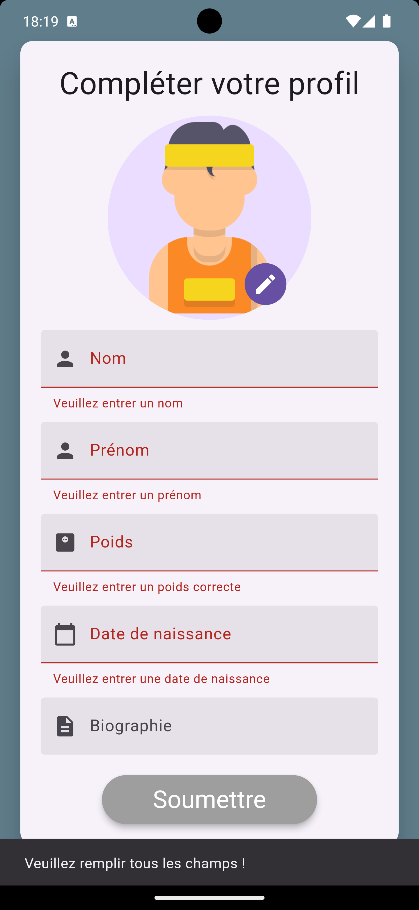
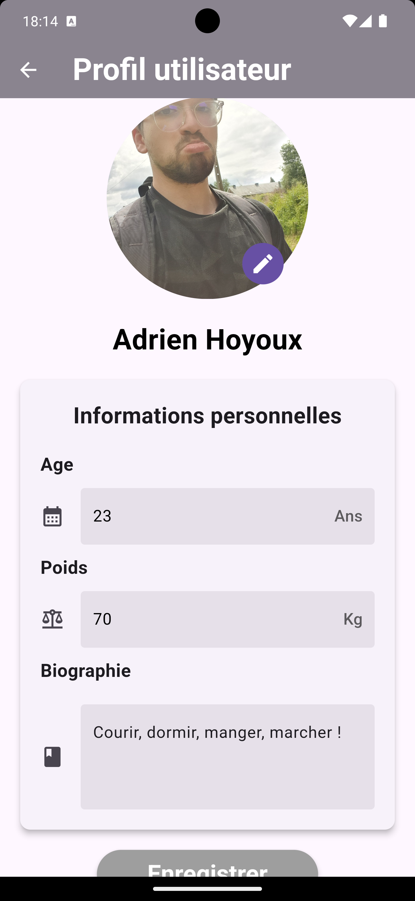
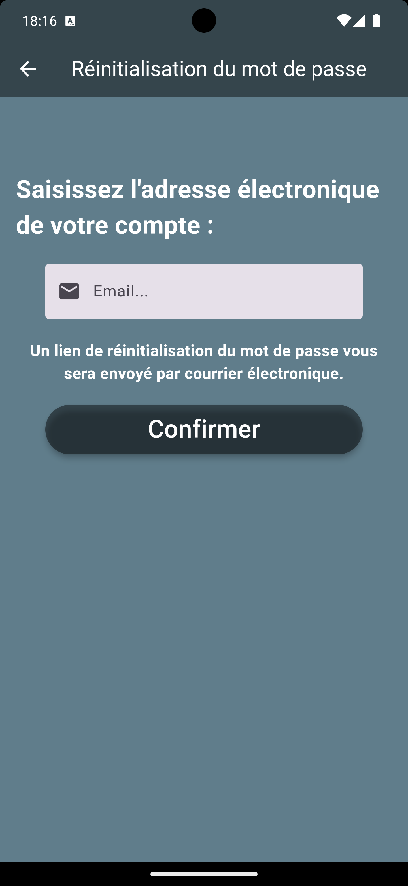
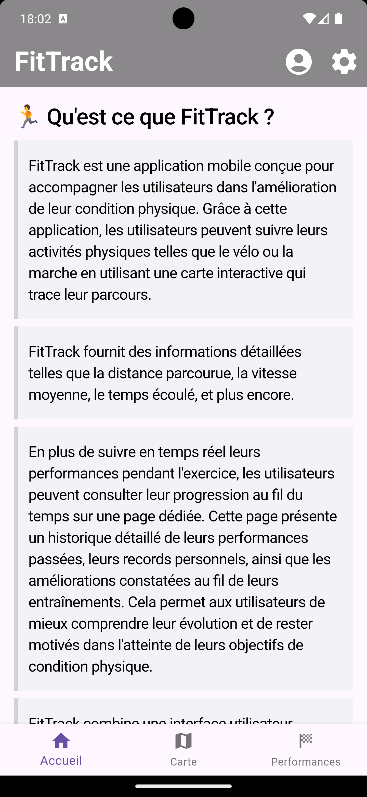
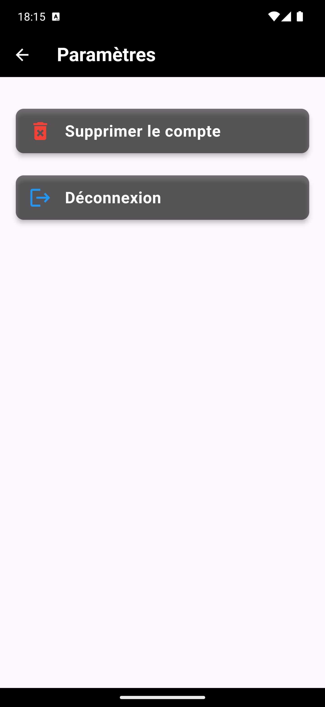
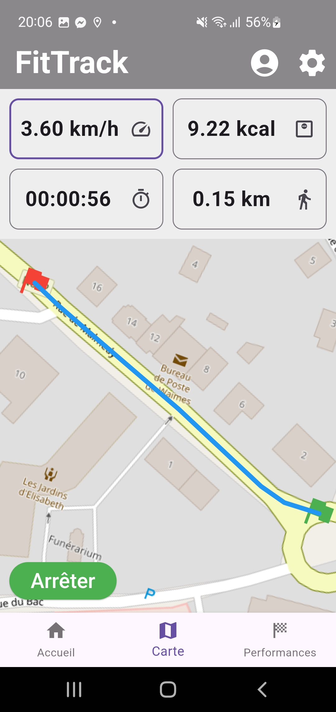
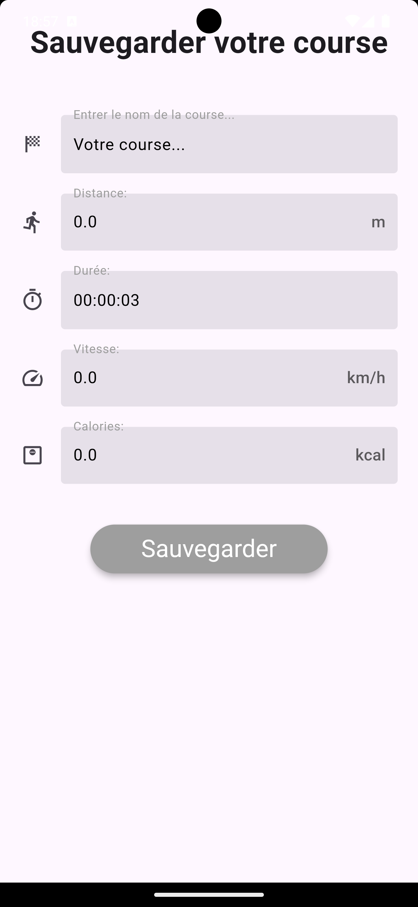
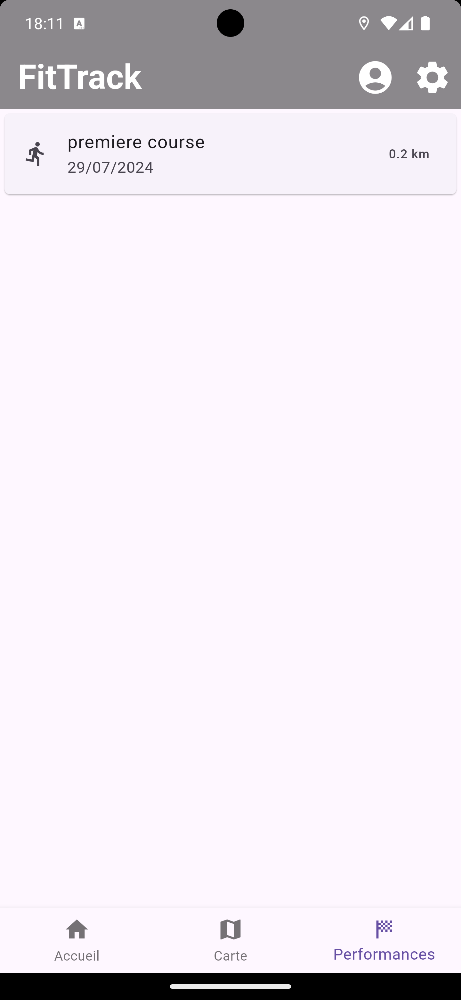
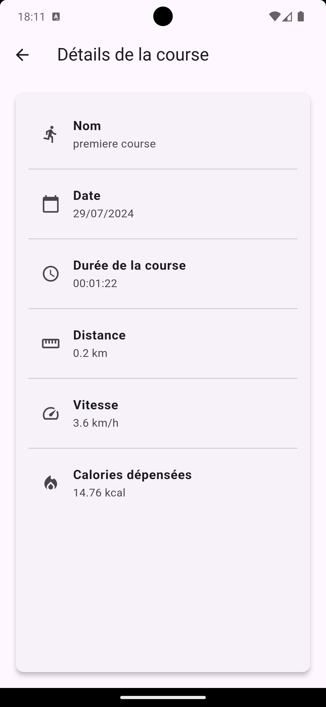
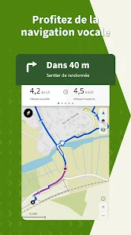

# FitTrack


## 🏃 Qu'est ce que FitTrack ? 

>FitTrack est une application mobile conçue pour accompagner les utilisateurs dans l'amélioration de leur condition physique. Grâce à cette application, les utilisateurs peuvent suivre leurs activités physiques telles que la course ou la marche en utilisant une carte interactive qui trace leur parcours.


>FitTrack fournit des informations détaillées telles que la distance parcourue, la vitesse moyenne en km/h, le temps écoulé, et les calories dépensées.

>FitTrack combine une interface utilisateur intuitive regroupant diverses fonctionnalités telles que la modification du profil des utilisateurs, l'affichage des différentes courses effectuées par l'utilisateur mais également le lancement d'une course.

## 📁 Présentation des principaux dossiers

### **`classes`**
Ce répertoire contient les classes représentant les données de l'application. Vous y trouverez les modèles de données utilisés dans toute l'application.

### **`screens`**
Ce répertoire regroupe les différentes pages de l'application. Chaque page de l'interface utilisateur est définie ici.

### **`widgets`**
Ce répertoire contient les widgets personnalisés qui sont utilisés pour la page permettant le lancement d'une course. Ces widgets correspondent à la carte et au statistique affichée lors de sa course.

### **`services`**
Ce répertoire regroupe les interactions avec les services externes, tels que Firebase. Vous y trouverez une classe `DatabaseService` qui gère les interactions avec la base de données.

### ***`notifiers`***
Ce répertoire contient une classe qui étend la classe `ChangeNotifier` de Flutter. Il est utilisé pour gérer l'état de l'application et notifier les widgets lorsqu'un changement d'état se produit.

### **`routes`**
Ce répertoire contient les différentes routes de l'application. Ces grâce à ces routes que l'on peut naviguer entre les différentes pages de l'application.

## 📱 Aperçu de la maquette

<div style="text-align:center; margin-bottom: 40px">
  <h4>Page de connexion</h4>
  
  <p>C'est la première page que les utilisateurs voient lorsqu'ils ouvrent l'application. Elle permet aux utilisateurs de se connecter à leur compte en saisissant leur adresse e-mail et leur mot de passe. Elle propose également un lien pour réinitialiser le mot de passe en cas d'oubli et un lien pour se créer un compte en cas de besoin.</p>
</div>

<div style="text-align:center; margin-bottom: 40px">
  <h4>Page de première connexion</h4>
  
  <p>Lors de la première connexion, cette page est affichée à l'utilisateur pour compléter son profil. Via cette page, l'utilisateur sera obligé de remplir certains champs comme son nom, son prénom, sa date de naissance et son poids. Il pourra également ajouter une biographie et une photo s'il le souhaite.</p>
</div>

<div style="text-align:center; margin-bottom: 40px">
  <h4>Page de profil utilisateur</h4>
  
  <p>Cette page permet à l'utilisateur de voir et de modifier son profil. Il pourra voir son nom, son âge, sa biographie et son poids. Il pourra également modifier son poids.</p>
</div>

<div style="text-align:center; margin-bottom: 40px">
  <h4>Page de création de compte</h4>
  
  <p>Sur cette page, les utilisateurs peuvent créer un nouveau compte en saisissant leurs informations personnelles. La conception se concentre sur la simplicité et la facilité d'utilisation.</p>
</div>

<div style="text-align:center; margin-bottom: 40px">
  <h4>Page de réinitialisation du mot de passe</h4>
  
  <p>Cette page permet aux utilisateurs de réinitialiser leur mot de passe en cas d'oubli. Elle guide les utilisateurs à travers un processus sécurisé de récupération de compte.</p>
</div>

<div style="text-align:center; margin-bottom: 40px">
  <h4>Page d'accueil</h4>
  
  <p>Cette page est celle que l'utilisateur voit lorsqu'il est connecté à son compte. Elle affiche la partie introduction de ce README afin de présenter l'application à l'utilisateur.</p>
</div>

<div style="text-align:center; margin-bottom: 40px">
  <h4>Page des paramètres</h4>
  
  <p>Cette page permet à l'utilisateur de se déconnecter de son compte ou de supprimer son compte.</p>
</div>

<div style="text-align:center; margin-bottom: 40px">
  <h4>Page de lancement d'une course</h4>
  
  <p>Comme son nom l'indique, cette page permet à l'utilisateur de lancer une course. Elle est composée de deux widgets : la carte (basée sur OSM) qui affiche le parcours de l'utilisateur et les statistiques de la course effectuée, mises à jour en temps réel. Quand l'utilisateur le décidera, il pourra enregistrer sa course, la mettre en pause ou même l'annuler.</p>
</div>

<div style="text-align:center; margin-bottom: 40px">
  <h4>Page d'enregistrement de la course</h4>
  
  <p>Cette page permet à l'utilisateur de sauvegarder sa course. Il pourra également voir les statistiques de sa course, lui ajouter un nom et les enregistrer dans la base de données.</p>
</div>

<div style="text-align:center; margin-bottom: 40px">
  <h4>Page des courses effectuées</h4>
  
  <p>Cette page permet à l'utilisateur de voir les différentes courses qu'il a effectuées. Il pourra voir les statistiques de chaque course en cliquant sur l'une d'elles.</p>
</div>

<div style="text-align:center; margin-bottom: 40px">
  <h4>Page des statistiques d'une course</h4>
  
  <p>Cette page permet à l'utilisateur de voir les statistiques d'une course en particulier. Il pourra voir la distance parcourue, le temps écoulé, la vitesse moyenne et les calories dépensées.</p>
</div>


## 🎯 Objectifs
> ### 1. Suivi interactif du parcours :
  Permettre aux utilisateurs de suivre leur trajet en temps réel via une carte interactive, affichant leur position de début et leur itinéraire.
  
> ### 2. Fournir des détails sur la course :
  Offrir des statistiques détaillées telles que la distance parcourue, la vitesse moyenne, le temps écoulé et les calories dépensées.
  
> ### 3. Observation des performances :
 Permettre aux utilisateurs de consulter les statistiques de leurs courses précédentes, telles que la distance parcourue, le temps écoulé, la vitesse moyenne et les calories dépensées.

> ### 4. Personnalisation du profil utilisateurs :
 Permettre aux utilisateurs de personnaliser leur profil en ajoutant des informations telles que leur nom, leur âge, leur poids, leur biographie et leur photo de profil.

> ### 5. Interface utilisateur intuitive :
  Concevoir une interface conviviale et intuitive, facilitant la navigation et l'utilisation des fonctionnalités de suivi et d'analyse. 

> ### 6. Compatibilité multi-plateforme :
 Assurer une compatibilité optimale avec les appareils iOS et Android, permettant aux utilisateurs de profiter de l'application sur différents appareils.


## 📝 Fonctionnalités

### **`Connexion et inscription`**
 - Un utilisateur peut décider de créér un compte ou de se connecter à son compte existant.

### **`Profil utilisateur`**
- Un utilisateur peut voir et modifier son profil. Il peut voir son nom, son âge, sa biographie et son poids et sa photo de profil. Il peut également modifier son poids, sa biographie et sa photo de profil.

### **`Lancement d'une course`**
- Un utilisateur peut lancer une course en appuyant sur un bouton. Il peut voir sa position sur une carte interactive et les statistiques de sa course en temps réel.

### **`Enregistrement d'une course`**
- Un utilisateur peut enregistrer sa course en appuyant sur un bouton. Il peut voir les statistiques de sa course, lui ajouter un nom et les enregistrer dans la base de données.

### **`Mise en pause d'une course`**
- Un utilisateur peut mettre en pause sa course en appuyant sur un bouton.

### **`Annulation d'une course`**
- Un utilisateur peut annuler sa course en appuyant sur un bouton. Ceci viendra réinitialiser les statistiques de la course et supprimer son parcours sur la carte.

### **`Réinitialisation du mot de passe`**
- Un utilisateur peut réinitialiser son mot de passe en appuyant sur un bouton. Il recevra un e-mail avec un lien pour réinitialiser son mot de passe.

### **`Suppression du compte`**
- Un utilisateur peut supprimer son compte en appuyant sur un bouton. Il devra faire une confirmation avant de supprimer son compte.

### **`Déconnexion`**
- Un utilisateur peut se déconnecter de son compte en appuyant sur un bouton.

### **`Consultation des courses effectuées`**
- Un utilisateur peut voir les différentes courses qu'il a effectuées. Il peut voir les statistiques de chaque course en cliquant sur l'une d'elles.

## 🔍 Etude de l'existant
<div style="text-align: center;">

 ### **komoot - rando, vélo & course**

- **Description** : komoot est une application mobile qui permet aux utilisateurs de planifier, enregistrer et partager leurs activités de plein air telles que la randonnée, le vélo et la course.


- **Ce qui m'a interressé dans cette application** : La disposition des éléments sur l'interface permettant de lancer un course mais aussi le fait de voir les statistiques en temps réel.


**image de komoot :**

  
</div>

## 🛠️ Outils

**J'aimerai parler dans cette section de tous les outils que j'ai pu utiliser pour la réalisation du projet**

### **1. Firebase**

- **Base de données en temps réel**  
  Utilisation de Firebase pour créer une base de données en temps réel, permettant de stocker diverses informations :

    - **Authentification des utilisateurs**  
      Firebase est utilisé pour l'authentification des utilisateurs. Il stocke l'adresse e-mail et le mot de passe de chaque utilisateur, et attribue un UID (Identifiant Unique) à chaque utilisateur.

    - **Stockage des informations des utilisateurs**  
      Les informations des utilisateurs sont stockées dans une collection appelée `users`. Chaque document de cette collection est identifié par l'UID de l'utilisateur et contient les données spécifiques à celui-ci. De plus, chaque utilisateur possède une sous-collection `races`, qui enregistre les différentes courses effectuées.

    - **Stockage des photos de profil**  
      Firebase Storage est utilisé pour stocker les photos de profil des utilisateurs.

### **2. Flutter_map**
- **Carte interactive**
 
Flutter map est une bibliothèque qui permet d'afficher des cartes interactives dans une application Flutter. Elle est basée sur OpenStreetMap (OSM) et fournit des fonctionnalités telles que le zoom, le déplacement et le marquage de la position de l'utilisateur.
  
  
C'est cette bibliothèque qui est utilisée pour afficher la carte interactive sur la page de lancement d'une course et on vient également utilisé diverses fonctionnalités tels que le zoom, un mapController, des markers et des polyLine.


### **3. Provider**
- **Gestion de l'état**
  
Provider est une bibliothèque qui permet de gérer l'état de l'application de manière efficace. Elle est utilisée pour notifier les widgets lorsqu'un changement d'état se produit, et pour reconstruire les widgets qui dépendent de cet état.

Cette bibliothèque est utilisée pour gérer l'état d'une course et transmettre d'un widgets à un autre les informations de la course en cours, ainsi que les différents état que cette dernière peut prendre (pause, enregistrée, annulée).

### **4. File Picker**
- **Sélection de fichiers**

File picker est une bibliothèque qui permet de sélectionner des fichiers sur un appareil. Elle est utilisée pour permettre aux utilisateurs de choisir une photo de profil à partir de leur galerie.

C'est donc grâce à cette bibliothèque que l'utilisateur peut choisir une photo de profil lors de la création de son compte ou lors de la modification de son profil.

### **5. intl**

- **Formattage des dates**

Intl est une bibliothèque qui permet de formater les dates et les heures dans une application Flutter. 

Elle est utilisée pour afficher la date de naissance de l'utilisateur dans un format lisible.


### **6. Flutter Markdown**

- **Affichage de fichier .md**

Flutter Markdown est une bibliothèque qui permet d'afficher des fichiers Markdown dans une application Flutter.

Elle est utilisée pour afficher le contenu de ce README dans l'application, afin de présenter l'application aux utilisateurs.

### **7. Geolocator**

- **Géolocalisation**

Geolocator est une bibliothèque qui permet d'accéder à la géolocalisation de l'appareil. Elle fournit des informations sur la position de l'utilisateur, telles que la latitude, la longitude et la vitesse.

Elle est utilisée pour suivre la position de l'utilisateur en temps réel lorsqu'il lance une course et pour récupérer sa vitesse.

### **8. Latlong2**

- **Conversion des coordonnées**

Latlong2 est une bibliothèque qui permet de convertir des coordonnées géographiques en différentes unités de mesure. Elle fournit des fonctions pour convertir des coordonnées en degrés décimaux, en degrés minutes secondes et en radians.

Elle est utilisée pour convertir les coordonnées géographiques, afin de les afficher sur la carte.


## ⚙️ Compilation du projet

### **1. Cloner le projet**

```bash 
 ### Pour cloner le projet, exécutez la commande suivante :
 
 #### https
    git clone https://github.com/AdrienHoyoux/myappflutter.git
    
 #### ssh
    git clone git@github.com:AdrienHoyoux/myappflutter.git

 #### github cli
    gh repo clone AdrienHoyoux/myappflutter
```

### **2. Version de Flutter**

```bash
 ### Pour vérifier la version de Flutter, exécutez la commande suivante :
 flutter --version
```

La version de flutter pour exécuter ce projet est v. 3.22.2  que vous pouvez télécharger [ici](https://docs.flutter.dev/release/archive).

### **3. Version de Dart**

```bash
 ### Pour vérifier la version de Dart, exécutez la commande suivante :
 dart --version
```

La version de dart pour exécuter ce projet est v. 3.4.3  que vous pouvez télécharger [ici](https://dart.dev/get-dart/archive).

### **4.Version du SDK**
    
```bash
  ### Pour vérifier la version du SDK, exécutez la commande suivante :
  flutter doctor
```
La version du SDK est Android SDK version 34.0.0) que vous pouvez télécharger dans la bibliothèque IntelliJ IDEA et l'ajouter à votre structure de projet.

### **5. Packages**

```bash
 ### Pour installer les packages, exécutez la commande suivante :
 flutter pub get
```

Si vous avez des problèmes aux niveaux des dépendences présentent dans les packages, vous pouvez supprimer le fichier `pubspec.lock`, exécuter la commande `flutter clean` et réexécuter la commande `flutter pub get`.


### **6. Configuration Firebase**

Pour exécuter ce projet, vous devez configurer Firebase en suivant les étapes suivantes :

1. Créez un projet Firebase sur le [site officiel de Firebase](https://console.firebase.google.com/).
2. Ajoutez une application Android à votre projet Firebase.
3. Téléchargez le fichier `google-services.json` et ajoutez-le au dossier `android/app` de votre projet.
4. Ajoutez les dépendances Firebase à votre projet Flutter en suivant les instructions sur le [site officiel de Firebase](https://firebase.flutter.dev/docs/overview).
5. Ajoutez les règles de sécurité Firestore suivantes à votre projet Firebase :

```bash 
rules_version = '2';

service cloud.firestore {
  match /databases/{database}/documents {
    match /{document=**} {
      allow read, write: if true;
    }
  }
}
```

### **7. Exécution du projet**

Lancer votre émulateur ou connecter votre appareil à votre ordinateur.

Lancer le projet en exécutant la commande suivante :
```bash
 ### Pour exécuter le projet, exécutez la commande suivante :
 flutter run
```
Ou 

Depuis IntelliJ IDEA, ouvrez le projet et cliquez sur le bouton ▶️ pour exécuter le projet.


## ⭐ Conclusion

Ce projet fait référence à un cours de développement mobile (Flutter) que j'ai suivi à la Haute Ecole de la Province de Liège. Il m'a permis de mettre en pratique les concepts appris en cours et de développer une application mobile complète, de la conception à la réalisation.